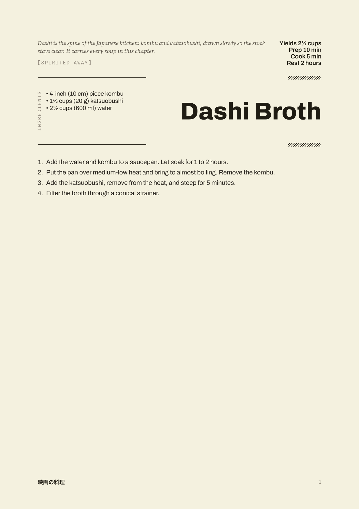
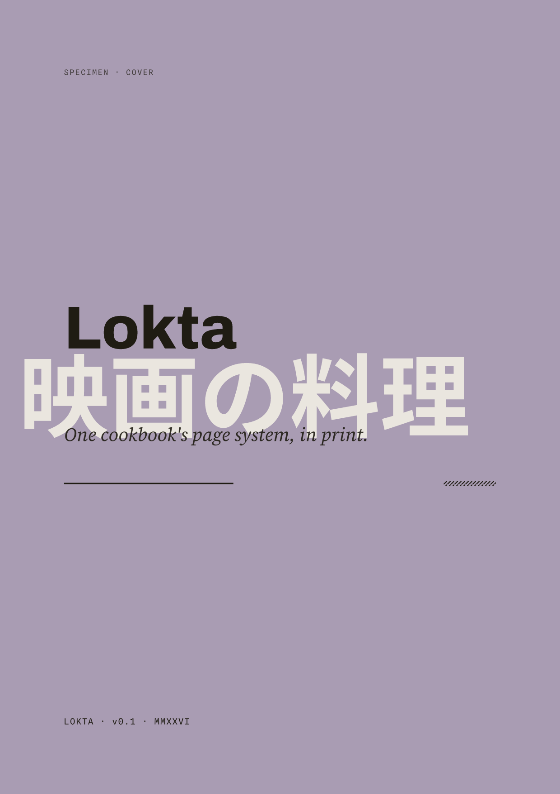
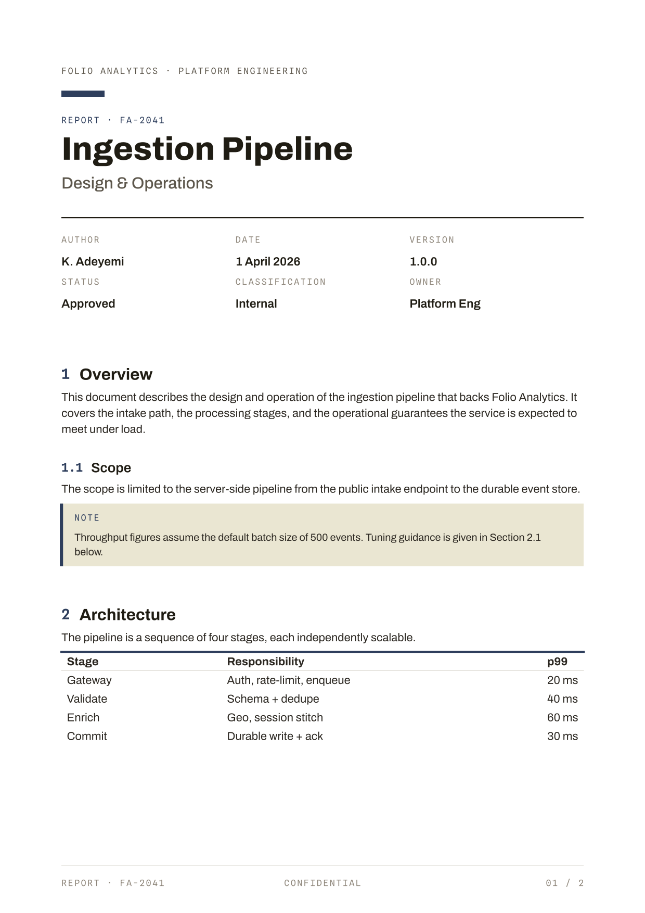

# lokta-typst

Editorial document themes for [Typst](https://typst.app), from the
[Lokta](https://github.com/msradam/lokta) design system. The print arm: the same
cream stock, hatched rules, tracked mono labels, and right-aligned grotesk titles,
as page templates. Fonts are vendored (SIL OFL), so output is identical everywhere.

<p>
  
  
  
</p>

## Templates

| Template | What it is |
| --- | --- |
| `lokta-tech` | White technical report. Numbered headings, mono section numbers, hard rules. |
| `lokta-report` | Cream editorial report. The warm counterpart to `lokta-tech`. |
| `lokta-article` | Long-form editorial. Kicker, deck, byline, serif body. |
| `lokta-bulletin` | Single-sheet notice. Mono-forward, marigold header. |
| `lokta-letter` | Correspondence. Sender block, subject, signature. |
| `lokta-cover` | Pigment ground with the vertical 光の写本 spine. |
| `lokta-recipe` | After the cookbook page: film note, vertical Ingredients label, numbered steps. |
| `lokta-doc` | The cream editorial base the others build on. |

Helpers: `lk-label`, `lk-rule`, `lk-measure`, `lk-endmark`, `lk-note`, `lk-quote`.

## Install

Typst does not embed package fonts, so the vendored static fonts (Archivo, Spline
Sans Mono, Source Serif 4, Noto Sans JP) ship in `fonts/` and are passed with
`--font-path`.

### Local package (recommended)

Clone, then install it into the Typst local package directory:

```bash
git clone https://github.com/msradam/lokta-typst
node lokta-typst/install.mjs
```

```typ
#import "@local/lokta:0.1.0": *

#show: lokta-tech.with(
  title: "Ingestion Pipeline",
  org: "Folio Analytics",
  doc-id: "FA-2041",
  meta: ("Author": "K. Adeyemi", "Date": "1 April 2026", "Status": "Approved"),
)

= Overview
Your content here.
```

Compile with the path the installer prints:

```bash
typst compile --font-path "<printed path>/fonts" your-doc.typ
```

### Direct import (no install)

```typ
#import "/path/to/lokta-typst/lokta.typ": *
```

```bash
typst compile --font-path /path/to/lokta-typst/fonts your-doc.typ
```

## Examples

One file per template, all in this repo. The rendered PDFs are in `examples/`.

```bash
typst compile --font-path fonts example.typ        # the technical report
typst compile --font-path fonts example-recipe.typ # the recipe
```

## Diagrams

Pre-render a Mermaid diagram to SVG with
[lokta-mermaid](https://github.com/msradam/lokta-mermaid) and place it:

```bash
mmdc -c lokta-mermaid.json -C lokta-mermaid.print.css -i diagram.mmd -o diagram.svg
```

```typ
#figure(image("diagram.svg", width: 90%), caption: [Pipeline stages.])
```

## License

MIT. Fonts are SIL OFL. Part of the [Lokta](https://github.com/msradam/lokta)
design system, drawn from the cookbook *Cuisine on Screen* (Sachiyo Harada,
Prestel) and Professor Siddika Kabir's *Ranna Khaddo Pushti*.

## lokta-hitec

`lokta-hitec/` mirrors the upstream [HITEC](https://github.com/ShabbyGayBar/hitec)
technical-document template API 1:1, wearing Lokta tokens and furniture. An
existing HITEC document compiles by changing only the import.

```typ
#import "lokta-hitec/lib.typ": *
#let (title, author, company, confidential, date, double-sided, print,
      doc, title-page, title-block) = documentclass(title: [Report], author: "A. Author")
#show: doc
#title-block()
```

```sh
typst compile --font-path fonts lokta-hitec/example.typ
```
